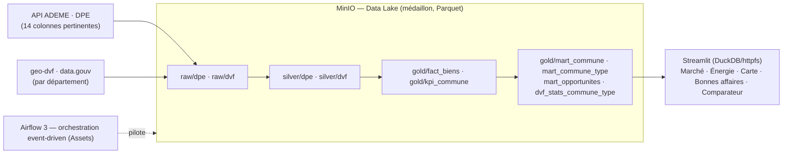

# 🏠 ImmoLake — Prix × Performance énergétique

Plateforme **Data Lakehouse** qui croise les prix de l'immobilier (DVF) avec les
diagnostics de performance énergétique (DPE / ADEME) pour répondre à une question métier :

> **Quel est l'impact de l'étiquette DPE sur le prix au m² par commune, et peut-on
> détecter les biens sous-cotés (bonnes affaires) ou sur-cotés (risques) ?**

Contexte : avec la loi Climat & Résilience, les **passoires thermiques (DPE F/G)** sont
progressivement interdites à la location. L'objectif est d'aider un investisseur à cibler
les communes / biens au meilleur rapport prix / rénovation.

## Architecture (v2 — DuckDB + Streamlit)



- **Ingestion** : API ADEME (DPE) via le Custom Hook `AdemeApiHook`, **par département** et en
  **streaming** (générateur paginé, mémoire bornée) ; DVF géolocalisé téléchargé **par département**
  (aligné sur le périmètre DPE). Aucune donnée chargée en totalité en mémoire.
- **Transformations** : **DuckDB** en SQL (`include/sql/*.sql`), lit/écrit le Parquet MinIO via
  `httpfs`/S3 — `raw → silver → gold → marts`. Plus aucun pandas ni Postgres (la v1 calait au-delà
  de ~200 k logements/ville).
- **Serving + BI** : **Streamlit** (`streamlit_app/`, port 8501) interroge directement le `gold/*`
  et `ref/*` Parquet via DuckDB. Remplace le couple Postgres/Metabase de la v1.
- **Orchestration event-driven** : les DAGs sont chaînés par des **Assets Airflow 3**
  (`ingest --RAW_DPE→ transform --GOLD_FACT→ marts`), avec retries/backoff et un **data quality gate**.

Décisions techniques détaillées (ADR) : voir [docs/ARCHITECTURE.md](docs/ARCHITECTURE.md).

## Stack & accès

| Service | Rôle | Accès |
|---|---|---|
| **Airflow 3.x** (LocalExecutor) | Orchestration | http://localhost:8080 — `airflow` / `airflow` |
| **MinIO** | Data Lake S3 — médaillon `raw`/`silver`/`gold` + `ref` (Parquet) | http://localhost:9001 — `minio_admin` / `minio_password_2026` |
| **Streamlit** | Front analytique (DuckDB sur le Parquet MinIO) | http://localhost:8501 |

Conteneurs annexes : `postgres-airflow` (métadonnées Airflow, interne), `minio-init` (one-shot :
crée le bucket, charge `ref/` + le snapshot de données).

## DAGs

| DAG | Déclencheur | Fait |
|---|---|---|
| `immolake_ingest_daily` | `@daily` / manuel | API ADEME → `raw/dpe/dt=/dep=*` (1 tâche mappée par département, `select` des colonnes utiles) ; **produit l'asset `RAW_DPE`**. |
| `immolake_transform_daily` | asset `RAW_DPE` | DVF par département → `raw/dvf` ; DuckDB `raw→silver→gold/fact_biens` + `gold/kpi_commune` ; **data quality gate** ; **produit `GOLD_FACT`**. |
| `immolake_marts_daily` | asset `GOLD_FACT` | DuckDB → `mart_commune`, `mart_commune_type`, `mart_opportunites`, `dvf_stats_commune_type`. |
| `immolake_seed_ref` | manuel | (Re)génère les dimensions `ref/` (`dim_commune`, `dim_dpe`, `dim_type_bien`) + pousse `geo_commune`. |

## Données

### Sources
- [API DPE logements existants (ADEME)](https://data.ademe.fr/datasets/dpe03existant) — `dpe03existant` (~15 M de DPE).
- [DVF géolocalisées (geo-dvf)](https://files.data.gouv.fr/geo-dvf/latest/csv/) — fichiers CSV.gz **par département**.
- [Référentiel communes INSEE](https://geo.api.gouv.fr/) — `dim_commune` (national) + `geo_commune` (centroïdes des départements couverts → carte en points).

### Couverture livrée (snapshot committé)
Le snapshot embarqué couvre **28 départements** (12 métropoles — Paris, Lyon, Marseille, Bordeaux,
Toulouse, Nice, Nantes, Rouen, Montpellier, Lille, Rennes, Grenoble — + 10 villes moyennes + 6 petits
ruraux), soit **~6,3 M de logements DPE**, **10 382 communes**, prix/m² médian réaliste (~3 200 €,
de ~600 € en rural à ~14 600 € à Paris 6e). **Paris est complet** (815 869 DPE). Élargir = ajouter
des départements à `ADEME_DEPARTEMENTS` (ingestion additive).

### Colonnes pertinentes captées à l'ingestion (`DPE_SELECT_FIELDS`)
Le dataset ADEME compte ~230 colonnes ; on n'ingère que celles utiles aux cas d'usage (réseau + Parquet
allégés → on couvre plus de villes). Au-delà de l'identité (numéro, code INSEE/postal, nom commune,
date) et du logement (type, surface, **année de construction**), on capte le signal énergie/marché :

| Colonne (silver/gold) | Source ADEME | Sens métier |
|---|---|---|
| `etiquette_dpe` | `etiquette_dpe` | Étiquette énergie A→G (F/G = passoire) |
| `etiquette_ges` | `etiquette_ges` | Étiquette climat A→G (émissions) |
| `conso_energie` | `conso_5_usages_par_m2_ep` | Conso énergie primaire (kWh/m²/an) |
| `emission_ges` | `emission_ges_5_usages_par_m2` | Émissions GES (kg CO₂/m²/an) |
| `cout_energie_annuel` | `cout_total_5_usages` | Facture énergie estimée (€/an) |
| `energie_chauffage` | `type_energie_principale_chauffage` | Énergie de chauffage principale |
| `annee_construction` | `annee_construction` | Année de construction (âge du bâti) |

### Enrichissement prix (choix MVP)
Pas de matching adresse/parcelle : `gold/fact_biens` joint un **prix/m² médian DVF par
`code_insee × type_bien × tranche de surface`** (fallback `code_insee × type_bien`), puis
`prix = surface × prix_m2`. Les **percentiles** de prix (vraie dispersion) vivent dans
`gold/dvf_stats_commune_type`, calculés sur les transactions DVF brutes.

## Front (Streamlit — 5 pages)

**Marché** (prix/m², sous-cotation territoriale), **Énergie** (passoires DPE & GES, conso, coût €/an,
émissions), **Carte** (points colorés par prix/m² ou % passoires), **Bonnes affaires** (détecteur
médiane − k·σ, opportunités commune × type), **Comparateur**. Filtres partagés (région / département /
commune, type, étiquette, prix, surface).

- Sélectionner **Paris / Lyon / Marseille** englobe automatiquement **tous leurs arrondissements**.
- Les filtres *surface* / *étiquette* portent sur le grain logement (répartition A→G de la page Énergie) ;
  au grain commune ils sont sans effet (les marts sont agrégés).
- Un filtre sans résultat affiche « aucune donnée » ; les 4 villes de démonstration n'apparaissent que
  si le lac est réellement vide (pas de snapshot ni de pipeline).

## Démarrage rapide

```bash
# 1. Configuration
cp .env.example .env
# (Linux/Mac) aligner l'UID Airflow : echo "AIRFLOW_UID=$(id -u)" >> .env

# 2. Lancer la stack (le snapshot de données est restauré au boot -> dashboards peuplés immédiatement)
docker compose up -d
docker compose logs -f airflow-init   # suivre l'init au 1er démarrage
```

Front **Streamlit** : http://localhost:8501 — peuplé dès le `up` grâce au snapshot committé.

### Rejouer le pipeline sur des données fraîches
Dépauser puis déclencher les DAGs (l'ordre s'enchaîne automatiquement par les assets) :

```bash
docker compose exec -T airflow-scheduler airflow dags unpause immolake_ingest_daily
docker compose exec -T airflow-scheduler airflow dags trigger  immolake_ingest_daily
# -> transform puis marts se déclenchent seuls (assets RAW_DPE / GOLD_FACT)
```

### Variables importantes (`.env`)

| Variable | Usage |
|---|---|
| `ADEME_DEPARTEMENTS` | Liste des départements à ingérer (défaut : **28 départements** — 12 métropoles + villes moyennes + petits ruraux). **Plus de départements = plus de villes.** |
| `ADEME_MAX_PAGES` | Plafond de pages par département (vide = tout ; p.ex. `20` pour une démo rapide). |
| `ADEME_PAGE_SIZE` / `ADEME_MAX_ACTIVE_TASKS` | Taille de page ADEME / parallélisme des départements. |
| `DVF_YEAR` | Millésime DVF (défaut `2024`). |
| `DVF_DEPARTEMENTS` | Périmètre DVF (défaut = `ADEME_DEPARTEMENTS`). |
| `DVF_CSV_URL` | Override : un unique CSV DVF (commune) au lieu de la couverture par département. |

> Couvrir « le plus de data » = élargir `ADEME_DEPARTEMENTS`. L'ingestion DPE est la partie longue
> (pagination de l'API) ; capper avec `ADEME_MAX_PAGES` pour un run de démonstration rapide. Le DVF
> se télécharge automatiquement pour les mêmes départements (prix cohérents partout).

## Modèle de données (gold / marts)

```
ref/dim_commune (code_insee, nom, departement, region, population)   ref/dim_dpe (etiquette, label_passoire)
ref/geo_commune (code_insee, latitude, longitude, geometry_json)     ref/dim_type_bien

gold/fact_biens (dt, code_insee, etiquette, etiquette_ges, type_bien, tranche_surface, surface,
                 prix_m2, prix, conso_energie, emission_ges, cout_energie_annuel, energie_chauffage,
                 annee_construction, date_etablissement)
gold/mart_commune        (prix/m² médian, % passoires DPE & GES, conso/émissions moy, coût énergie médian,
                          année de construction médiane, indice de sous-cotation, z & rang départemental)
gold/mart_commune_type   (prix/m² médian par commune × type)
gold/mart_opportunites   (détecteur médiane − k·σ : score, étiquette d'opportunité)
gold/dvf_stats_commune_type (percentiles p10..p90 du prix/m² sur les transactions DVF brutes)
```

## Idempotence (obligatoire)

Chaque run rejoue le même résultat — les partitions de sortie sont purgées puis réécrites :
`raw/dpe/dt=/dep=*`, `raw/dvf/dt=/dep=*`, `silver/*/dt=`, `gold/fact_biens/dt=`, `gold/kpi_commune/dt=`,
et les marts. Rejouer un même `dt` doit donner le même `COUNT(*)`.

## Snapshot de démonstration (données dès `docker compose up`)

Pour que **toute l'équipe ait des dashboards peuplés sans relancer le pipeline**, un snapshot des
`gold/*` (+ `ref/geo_commune`) est **committé** dans `include/snapshot/` et **chargé au boot** par
`minio-init`. Régénérer après un run frais :

```bash
bash scripts/make_snapshot.sh   # exporte le gold de MinIO vers include/snapshot/
```

## Tests

```bash
docker compose exec airflow-scheduler pytest tests/ -v
```

- `test_dags.py` : aucun import en erreur, DAGs présents, `catchup=False`.
- `test_hook.py` : Custom Hook ADEME (mock `requests`) — pagination par curseur + `select` des colonnes.
- `test_transform_sql.py` : SQL DuckDB `silver_dpe` (nettoyage/dédup/colonnes), `silver_dvf` (filtre prix/surface + parsing CSV) et `gold_fact_biens` (enrichissement prix).
- `test_streamlit_*.py` : filtres, carte, opportunités du front.

## Contribution

Workflow obligatoire : **1 issue = 1 branche**, PR vers `main`, relecture, puis merge.
**Jamais de commit direct sur `main`.** Détails dans [docs/CONTRIBUTING.md](docs/CONTRIBUTING.md).

## Dépannage

| Symptôme | Solution |
|---|---|
| `airflow-init` boucle / permissions logs | Sous Linux/Mac, fixer `AIRFLOW_UID=$(id -u)` dans `.env` puis relancer |
| Port déjà utilisé (8080/8501/9000/9001) | Modifier le mapping dans `docker-compose.yml` |
| Front Streamlit vide | Vérifier que le snapshot est chargé (`minio-init`) ou rejouer le pipeline ; le front retombe sinon sur des données de démo |
| `KeyError: 'ds'` sur un run manuel | Résolu : `_ds` retombe sur la date du jour quand `logical_date` est `None` (Airflow 3) |
| Bucket MinIO absent | `docker compose restart minio-init` |
| Ingestion très longue | Capper `ADEME_MAX_PAGES` et/ou réduire `ADEME_DEPARTEMENTS` |
